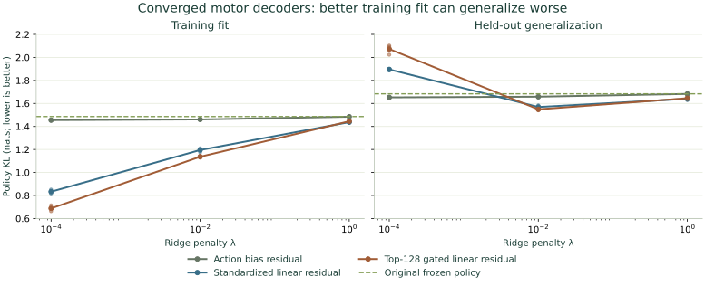

# Converged decoding separates optimization from generalization

The motor features support a substantially better training fit than the earlier
Adam screen suggested, but most of that improvement does not generalize.
All **27 fits** complete and meet the declared numerical optimization-error
bound. At ridge .01, a gated linear residual improves mean validation-subset KL
from **1.68393 to 1.54872**; the paired bias-only control reaches **1.65879**.
Every seed improves against both references. This remains a frozen-core
diagnostic, with no new full-network or matched-CNN result.

Lines show three-seed means; small points show individual fitted seeds. The
dashed line is each split's original frozen policy. These are not uncertainty
intervals. [All endpoints, conditional family intervals, source identities and
replica receipts](results/motor-convergence-v1.json).

## What changes

The [registered contract](../configs/motor-convergence-v1.json) reuses exactly
the [earlier motor banks](motor-learnability-study.md): 16,384 training positions
from 4,158 opening families and 8,192 validation positions from 254 disjoint
families. Three dense current-board/K8 cores, seeds 4/5/6, each previously saw
32,000 labeled exposures. Training D4 views, original logits, all circuit
weights and value predictions stay fixed. No new graph inference is needed.

Each decoder adds a zero-initialized residual to the original policy logits:

\[
z(x)=z_0(x)+(\phi(x)-\mu)A+b.
\]

The three feature choices are:

- **Bias-only:** no additional motor features; learn an action-bias correction
  over the existing policy. The original policy still depends on the motors.
- **Standardized linear:** all 2,129 raw motor rates before readout gains,
  standardized using the original training-only statistics and 1e-6 scale floor.
- **Gated linear:** the same standardized rates, retaining at most the largest
  128 positive deviations per position. This is an external decoder transform;
  neuronal propagation is unchanged.

For every feature choice, its centering mean is fitted on training only.
The objective is raw-teacher legal-action cross entropy plus
`λ/2 × (||A||² + ||b||²)`, at λ = .0001, .01 and 1. No validation enters a fit.
The gate is a modeling hypothesis, not a measured biological firing rule.

## Conditioning and the stopping criterion

For training covariance `C = Q diag(d) Qᵀ`, form

\[
X_w=(\phi-\mu)Q\operatorname{diag}((d+\lambda)^{-1/2}),\qquad
A=Q\operatorname{diag}((d+\lambda)^{-1/2})U.
\]

The full basis is retained, including constant and very weak directions;
negative numerical eigenvalues are clamped to zero. Positive λ makes the
coordinate change invertible. The weight penalty in conditioned coordinates
is `Σᵢ λ/(dᵢ+λ) ||Uᵢ||² / 2`. It therefore preserves the original regularized
objective as well as the affine function class; this is not feature selection.

FP64 analytic derivatives feed SciPy 1.18.1 L-BFGS-B, with at most 512 iterations
and 1,024 function evaluations. A solver's success flag alone is insufficient:
its iteration cap or relative objective test can stop before a useful fit.
[Optimizer stopping options](https://docs.scipy.org/doc/scipy/reference/optimize.minimize-lbfgsb.html).

Ridge regularizes both weights and intercept, making the original-coordinate
objective λ-strongly convex. Therefore

\[
F(\theta)-F^*\leq\frac{\|\nabla F(\theta)\|_2^2}{2\lambda}.
\]

At each endpoint, independently reconstruct original-coordinate logits,
objective and gradient, then compute this bound. The declared sufficient
threshold is **1e-4 objective units**. This is a numerical gradient-based bound,
not a formal interval-arithmetic certificate.

All 27 bounds pass. The six weakly regularized motor fits reach the 512-iteration
cap and retain the solver's unsuccessful termination flag; their independently
computed bounds still lie between **1.42e-5 and 6.12e-5**. The other 21 fits
terminate successfully. No endpoint is extended or discarded using validation.

## Every registered result

KL below is the mean over all three fitted seeds, in nats.

| Residual decoder | Ridge λ | Train KL | Validation KL | Validation change from paired bias-only |
|---|---:|---:|---:|---:|
| Bias-only | .0001 | 1.45487 | 1.65280 | 0 |
| Bias-only | .01 | 1.46086 | 1.65879 | 0 |
| Bias-only | 1 | 1.48473 | 1.68282 | 0 |
| Standardized linear | .0001 | .83279 | 1.89548 | +.24267 |
| Standardized linear | .01 | 1.19496 | 1.56892 | −.08987 |
| Standardized linear | 1 | 1.43734 | 1.64045 | −.04237 |
| Gated linear | .0001 | .68778 | 2.07265 | +.41985 |
| Gated linear | .01 | 1.13668 | 1.54872 | −.11007 |
| Gated linear | 1 | 1.44466 | 1.64554 | −.03729 |

At λ=.01, standardized-linear validation KL is **1.55299 / 1.57031 / 1.58347**;
gated-linear KL is **1.53994 / 1.54498 / 1.56125**. Gated minus bias-only has a
conditional paired-family 95% interval **[−.14134, −.04564]** and paired-seed
sample SD **.00877**. These 1,000-resample family intervals condition on the
three fitted weights; they do not estimate uncertainty across future training
seeds. The validation families have already informed earlier research.

The gated .01 policy's mean top probability is **.12918**, compared with
**.11021** for the original policy. Teacher top-move agreement rises from
**19.07% to 20.81%**. Weaker regularization raises confidence further but worsens
validation. Confidence is not an adequate optimization target.

## Cost, limits and the next decision

All solver objective/gradient calls consume **97,419,264 labeled-position
exposures** across the 27 fits. Independent gradient audits add **442,368**;
training and validation metric passes are recorded separately. Each core's nine
fits take **648 / 670 / 697 seconds**, using four pinned CPU cores on its owner.
The cores' prior training and the earlier decoder screen are additional work.
TPU use remains paused. This is not the budget of the matched-CNN comparison.

The original 36-case screen could not distinguish poor optimization from absent
motor information. These converged fits rule out that simple explanation for
the regularized affine objectives tested here: the motor features add useful
held-out signal, but increasingly accurate training fits substantially overfit
this bank. They do not establish either a motor-information ceiling or a
biological advantage. More training data, a better-trained recurrent core and
different propagation rules remain distinct hypotheses.

Next, audit how incoming-strength averaging transfers visual signal and
gradients through the graph. A subsequent propagation experiment should keep
this decoder/regularization contract fixed. Do not promote higher learning
rates or sharper activations solely because training loss falls. End-to-end
conditioning still needs its own Rust/JAX gradient and recovery qualification.

Four objective tests and three paired-analysis tests pass. Owner audits verify
every bank, basis, coefficient file, curve and per-position metric file. Each
owner's 51-file fit/archive bundle has a hash-verified copy on another worker;
the original banks already have independent replicas. All runtime copies remain
volatile. The main host retains small reports, without new bank/checkpoint
payloads. The public report records every termination and replica receipt.
