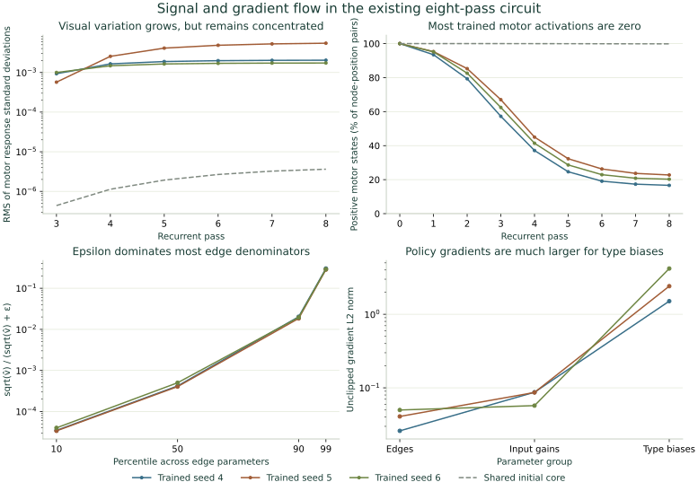

# Signal and gradient flow

The current circuit has weak, concentrated visual responses and strongly
unequal gradient scales. The independent recurrence and gradient checks pass.
These observations motivate an optimizer intervention and a separate
propagation study; they do not identify a winning modification.

[Contract](../configs/signal-flow-v2.json) ·
[Complete measurements](results/signal-flow-v2.json) ·
[Researcher walkthrough](../notebooks/README.md).

## Fixed sources and probes

This read-only CPU audit uses the existing dense-head seeds 4/5/6, each at
initialization and its fixed 1,000-update endpoint: 32,000 labeled exposures,
B32, eight hard-rate passes, current-board spherical input B, epsilon 1e-6.
All 165,122 nodes and 15,270,273 edges remain present. No model parameters,
optimizer moments, sampler states or decoder coefficients are updated.

The first 128 training positions and their exact D4 views come from the frozen
[motor banks](motor-learnability-study.md). The first 32 form the gradient
batch. Every seed uses the same positions and orientations. This is a small
mechanism probe, not validation or a new random sample. The initial circuit
strengths are shared across seeds; the heads and subsequent training differ.

For each position, compare the actual eye input with neutral gray eyes while
keeping all 84 context features unchanged. If the resulting rates are
`r_current` and `r_neutral`, the visual response is their difference. We retain
its mean, RMS and centered standard deviation at every neuron and pass,
alongside total rate variation and positive-state frequency. Neutral-image
and context combinations can be outside the training distribution. Response
variance is not an additive decomposition of total variance.

## Forward signal

At initialization, the RMS of visual-response standard deviations is
**.024063** at eye sensors and **3.6248e-6** at motors. Total motor variation
has RMS standard deviation **.0084165**, about **2,322 times** the visual-response
measure. Most motor variation across these positions therefore has little
sensitivity to this eye perturbation. This does not make nonvisual context
irrelevant or establish that the visual representation contains no information.

The initial median motor visual-response standard deviation is **6.74e-8**.
Training greatly increases its largest responses, while typical motor signals
remain weak:

| Checkpoint | Motor visual std, RMS | Median | 90th percentile | Largest motor's share of summed visual variances | Positive motor activations |
|---|---:|---:|---:|---:|---:|
| Shared initial circuit | 3.625e-6 | 6.740e-8 | 1.256e-6 | 28.62% | 99.86% |
| Trained seed 4 | .002036 | 0 | 1.500e-6 | 98.62% | 16.64% |
| Trained seed 5 | .005464 | 7.135e-9 | 1.674e-6 | 99.91% | 22.74% |
| Trained seed 6 | .001731 | 1.166e-9 | 1.651e-6 | 97.17% | 20.26% |

“Positive” counts node-position pairs at the final pass. Respectively
920/1,126/1,076 motors are positive on at least one of the 128 trained probes.
It does not mean that only this many neurons can ever activate, or that an
inactive neuron is permanently dead. Raw variance concentration alone does
not measure useful feature capacity; the converged decoder study already
shows that weaker motor directions can improve predictions.

All motors have a directed eye-to-motor path of two to five synaptic hops;
the median is three. **99.673% of edges** lie on a potential visual path that
can reach a motor within the seven synaptic hops available after input enters
an eight-pass computation. This ignores signs, cancellation and activation
gates. Simple anatomical disconnection is insufficient to explain the result.

Initial incoming absolute weight sums are approximately one for nonempty
rows. At motors, the median incoming L2 norm is **.08118**, and median
effective fan-in `(sum |w|)^2 / sum w^2` is **151.74**. Averaging many signals
can attenuate variation, but the amount depends on their covariance and signs.
These row statistics alone are not a stability or information-capacity proof.

## Backward signal and optimizer scales

The audited recurrence is

\[
h_{t+1}=(1-\alpha)\odot h_t+
\alpha\odot\bigl(W\operatorname{ReLU}(h_t)+b+I\bigr).
\]

With `g_t = ∂L/∂h_t` and `D_t = diag(h_t > 0)`, its adjoint is

\[
g_t=(1-\alpha)\odot g_{t+1}
 +D_tW^T(\alpha\odot g_{t+1}),\qquad
\frac{\partial L}{\partial I}=\sum_t\alpha\odot g_{t+1}.
\]

The independent FP64 implementation uses the recorded native states and
independently reconstructed FP32 weight/leak transforms. It checks native
gradients for edge parameters, type biases, type leaks, input gains and the
readout-gain VJP. It also records every intermediate state cotangent.

| Trained seed | Policy edge-gradient norm | Policy type-bias norm | Edge gradients larger than epsilon | Median saved edge epsilon factor |
|---|---:|---:|---:|---:|
| 4 | .02605 | 1.5081 | .413% | .0004190 |
| 5 | .04088 | 2.4100 | .556% | .0004045 |
| 6 | .05002 | 4.1861 | .399% | .0005017 |

The value objective has even larger type-bias norms: **56.60 / 13.71 / 90.27**,
versus edge norms **.7242 / .2430 / 1.0761**. These are separate, unclipped
objectives on the same batch, not the joint training gradient.

The last column is `sqrt(v_hat) / (sqrt(v_hat) + 1e-6)` from saved, bias-corrected
Adam second moments. At the median edge, epsilon reduces the denominator's
adaptive scaling factor to approximately **.04–.05%**. This is not an actual
update ratio: moment history, clipping, first moments and rates also matter.
Approximately **98.95–99.02%** of edge parameters have changed since
initialization, so “almost no edges changed” would also be inaccurate.

The existing optimizer computes one global gradient norm, clips every group
by the resulting common factor, updates moments, and only then applies
per-group learning rates. Consequently, the .01 bias rate multiplier does
not reduce biases' contribution to the clipping norm. This is an intended
implementation rule with a potentially unfavorable interaction, not a failed
gradient check. A controlled comparison of global and per-group clipping is
the [next registered optimizer candidate](../configs/group-clipping-study-v1.json);
retain the dense decoder, inputs, recurrent
equations, rates, epsilon and horizon while testing it.

The [existing joint-loss diagnostics](results/signal-joint-diagnostics-v1.json)
provide a complementary check. At update 1,000, biases account for
**99.966% / 99.957% / 99.970%** of the recomputed gradient's squared norm.
Those gradients are measured after the update on that training batch. The
recorded pre-update global norms are **43.91 / 62.43 / 45.79**, corresponding
to global clipping factors **.0228 / .0160 / .0218**. Do not substitute the
post-update group gradients for the pre-update gradients or infer a
counterfactual Adam update from these summaries. All four recorded diagnostic
intervals per seed are retained; no new training or inference was run for
this log analysis.

The already fitted standardized linear residual at ridge .01 raises the
fraction of edge gradients exceeding epsilon to **8.52–13.43%**. Its type-bias
gradients also grow substantially. This establishes dependence on the loss
and decoder; it does not show that attaching this head will improve joint
training. The residual was fitted on a larger training bank at a separately
reported cost.

Its gradient is converted through fixed readout gains to use the existing
embedding VJP. That conversion yields the correct **core** cotangent while
the gains are held fixed. The API's auxiliary gain derivative belongs to the
local converted objective; it is not the derivative of the original raw-motor
residual with respect to a changing gain. All numerical comparisons are
retained, but the report excludes that auxiliary derivative from scientific
gradient summaries. No gain or head update is proposed from it.

## Qualification and preservation

All **48 forward comparisons** and **75 parameter-group VJP comparisons**
pass their frozen elementwise tolerances. The maximum forward discrepancy is
3.07e-6; the maximum VJP relative L2 discrepancy is 1.30e-4. The largest VJP
absolute difference is .002272 on large gradients, within its relative
tolerance. Passing an absolute tolerance alone would not resolve the tiniest
individual signals. Eight tests cover directional derivatives, truncated
directed paths, context cancellation, task cotangents and incomplete-report
rejection. The summary reproduces byte for byte on another worker.

Each audit takes **212–227 seconds on four pinned CPU cores**. The 105 source,
array and report files have verified second-worker copies, in roughly 291 MB
archives per owner. Root holds only small JSON reports and plots. Shared RAM
buffers remain enforced; no TPU was initialized.

The first attempt stopped at import on all three workers because PyArrow was
absent. It loaded no data and performed no model computation. The successful
v2 reads a lossless, source-hashed JSON export of the superclass column;
mathematics, sample and tolerances are unchanged. Failed logs and frozen v1
sources remain in the archives. This is an operational recovery, not a
scientific retry after inspecting a bad result.

The evidence does not justify promoting a new propagation rule, stronger
gating or a larger global learning rate. First isolate the clipping/moment
interaction, then test a separately specified signal-preserving propagation
rule. Neither these probes nor the prior decoder fits establish a new
full-validation, playing-strength or matched-CNN result.
